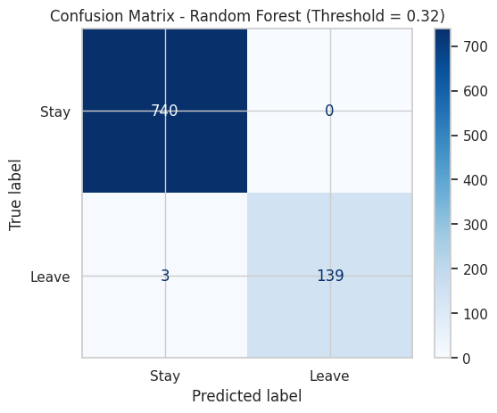
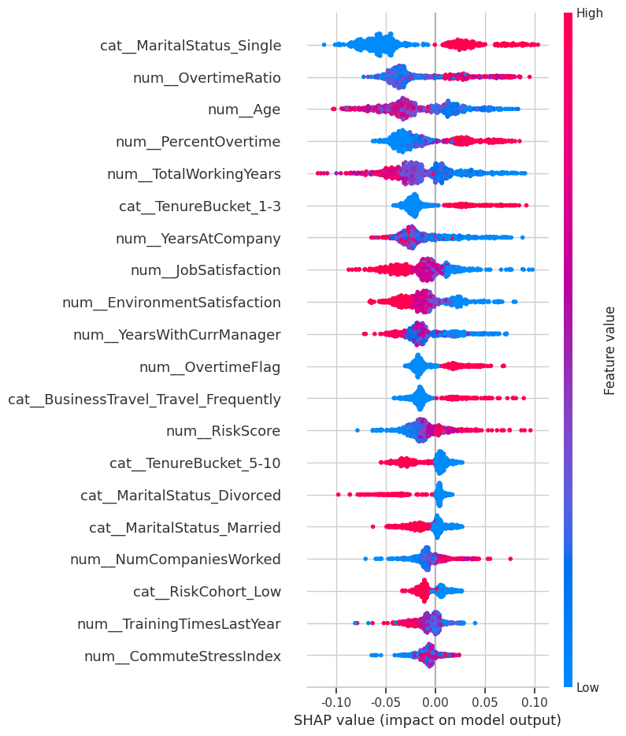
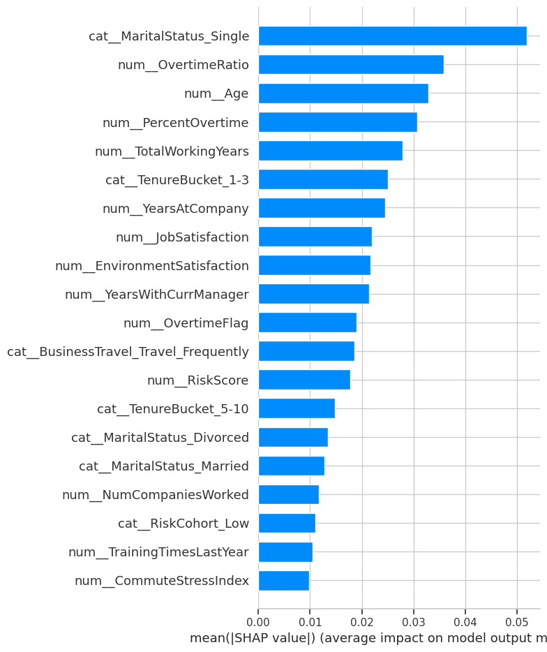
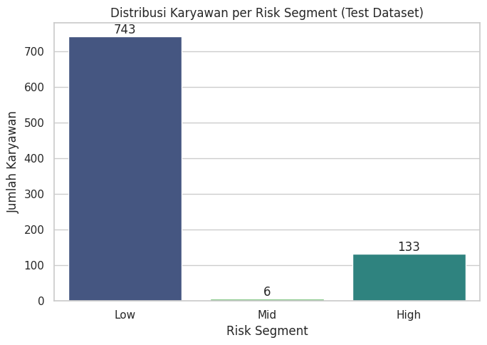
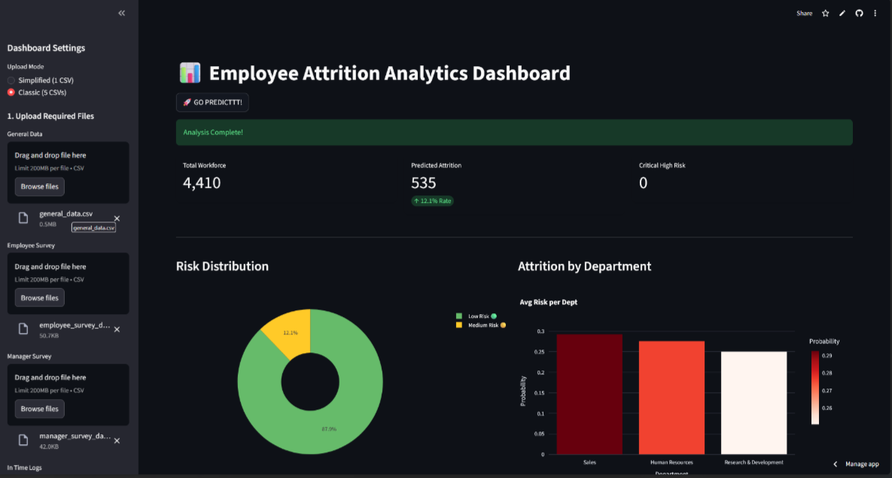

# Employee Attrition Risk Prediction System

An end-to-end data science project designed to predict employee attrition risk, identify key drivers, and support data-driven retention strategy.

---

## 1. Background and Objectives

### Background

The company is experiencing an attrition rate of **16.1%**, exceeding the healthy industry benchmark (~10% annually). Elevated attrition results in:

- Increased recruitment and onboarding costs  
- Loss of institutional knowledge  
- Reduced operational stability  
- Lower team productivity  

Without predictive analytics, retention efforts remain reactive and inefficient.

### Objectives

This project aims to:

- Identify key factors influencing employee attrition  
- Develop a predictive machine learning model  
- Segment employees into risk categories  
- Estimate financial impact of targeted retention strategies  

---

## 2. Problem Scope

### Scope of the Problem

- The project focuses on predicting voluntary employee attrition.
- The analysis is limited to historical HR data provided in the dataset.
- External macroeconomic or industry variables are not included.
- The model does not replace HR decision-making but supports prioritization.

### Model Output

The final model produces:

- Attrition probability (0–1)
- Binary prediction (Leave / Stay)
- Risk segmentation:
  - High Risk (> 0.60)
  - Medium Risk (0.32 – 0.60)
  - Low Risk (< 0.32)

---

## 3. Data and Assumptions

### Dataset Overview

- 4,410 employee records
- 30 features after integration
- Data sources include:
  - Demographic information
  - Job-related data
  - Employee survey results
  - Attendance and overtime logs

### Data Cleaning

- 121 missing values handled via median imputation
- No duplicate records detected
- Outliers treated in key numerical features
- Categorical variables encoded for modeling

### Feature Engineering

Engineered features include:

- OvertimeRatio
- AvgWorkingHours
- IncomePerHour
- CommuteStressIndex
- TenureBucket
- TimeSinceLastPromotionRatio
- RiskScore and RiskCohort

### Business Assumptions (Financial Simulation)

- Replacement cost = 1.5 × annual salary
- Retention intervention cost = $2,000 per employee
- Retention success rate assumed at 50%

---

## 4. Data Analysis

### 4.1 Exploratory Data Analysis (EDA)

Key insights from exploratory analysis:

| Feature Category        | Insight |
|-------------------------|----------|
| Workload (Overtime)     | Strong positive correlation with attrition |
| Age                     | Younger employees show higher attrition risk |
| Tenure                  | Shorter tenure associated with higher resignation probability |
| Job Satisfaction        | Lower satisfaction correlates with higher attrition |
| Income Level            | Higher income associated with lower attrition risk |

Workload-related features form a correlated cluster, indicating potential burnout-related behavior patterns.

---

### 4.2 Model Development

Algorithms evaluated:

- Logistic Regression
- Decision Tree
- Random Forest
- Gradient Boosting
- Support Vector Machine

---

### 4.3 Model Performance Comparison

| Model                | Accuracy | Recall (Leave) | F1 Score | ROC-AUC |
|----------------------|----------|----------------|----------|---------|
| Logistic Regression  | 0.78     | 0.73           | 0.52     | 0.81    |
| Decision Tree        | 0.98     | 0.95           | 0.94     | 0.97    |
| Random Forest        | 0.99     | 0.98           | 0.98     | 0.99    |
| Gradient Boosting    | 0.89     | 0.65           | 0.67     | 0.89    |
| SVM                  | 0.96     | 0.91           | 0.88     | 0.97    |

---

### Final Model: Random Forest

- Recall (Attrition Class): 98%
- ROC-AUC: ~0.99
- 139 out of 142 attrition cases correctly identified
- Threshold optimized at 0.32 (F2-score focus)

#### Confusion Matrix (Threshold = 0.32)



---

### 4.4 Model Interpretability (SHAP)

To ensure transparency and interpretability, SHAP (SHapley Additive Explanations) was used.

#### SHAP Summary Plot



#### SHAP Feature Importance (Mean |SHAP|)



Top 5 Drivers Identified:

1. Marital Status (Single)
2. Overtime Intensity
3. Age
4. Total Working Years
5. Job & Environment Satisfaction

---

### 4.5 Risk Segmentation

Employees were categorized into actionable risk tiers based on predicted probabilities.

#### Risk Distribution (Test Dataset)



This segmentation enables prioritized intervention strategies for HR teams.

---

## 5. Conclusion

- Workload intensity is the strongest driver of attrition.
- Early-career employees are more likely to resign.
- Satisfaction-related variables significantly affect retention.
- Random Forest provided the most stable and highest-performing results.
- The model effectively identifies high-risk employees for proactive intervention.

---

## 6. Recommendations

Based on the model findings:

1. Implement overtime monitoring thresholds.
2. Introduce structured mentoring for early-career employees.
3. Conduct regular satisfaction pulse surveys.
4. Provide flexible working arrangements where possible.
5. Use risk segmentation to prioritize intervention resources.

Potential attrition reduction: >5% with significant cost savings under assumed retention effectiveness.

### Future Improvements

- Deploy model monitoring for drift detection.
- Validate model using real-time HR production data.
- Explore ensemble stacking or XGBoost refinement.

---

## 7. Installation and Usage

### Requirements

- Python 3.9+
- pandas
- numpy
- scikit-learn
- shap
- matplotlib
- seaborn
- streamlit

Install dependencies:

```bash
pip install -r requirements.txt
```

### Running the Model

To train the model locally:

```bash
python model.py
```

To launch the Streamlit dashboard:

```bash
streamlit run app.py
```

---

## Deployment

Interactive dashboard:

https://hr-analytics-dataforge.streamlit.app

#### Dashboard Preview



---

## Technology Stack

- Python (Pandas, NumPy, Scikit-learn)
- SHAP (Explainability)
- Matplotlib & Seaborn
- Streamlit
- Git & GitHub
